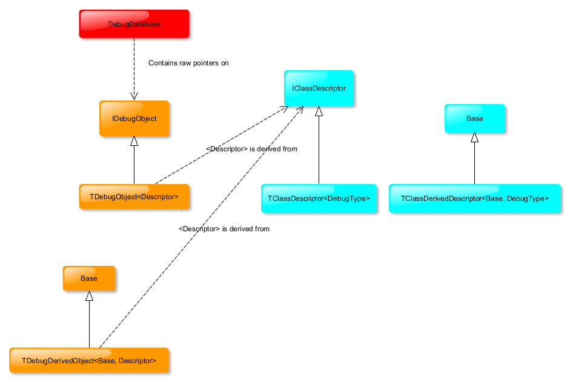
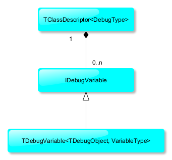
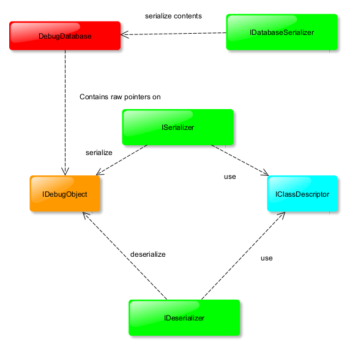

# Documentation Universal Debugger #

## Introduction ##
The purpose of UDebugger, behind this presumptuous name, is to provide an interface for monitoring classes of your program through a custom interface (TCP/interprocess communication etc.).

## Architecture ##
### Overview ###

- *DebugDatabase* is the container of all class you want to debug
- *IDebugObject* is the base class of all class you want to debug. this class automatically store/remove itself to DebugDatabase 
- *TDebugObject* is a template where parameter is **the descriptor of the class you want to debug**
- *IClassDescriptor* is a interface on Descriptor who describe the class you want to debug
- *TClassDescriptor* is a template where parameter is **the class you want to debug**

### Descriptor ###

Example of debug class *TestDebugClass*:
```C++
#include "TDebugObject.h"
#include "TDebugDescriptor.h"

class TestDebugClass;

// descriptor
class TestDescriptor : public Debugger::TClassDescriptor<TestDebugClass>
{
public:
    TestDescriptor();
    ~TestDescriptor() = default;
};

// class to debug
class TestDebugClass : public Debugger::TDebugObject<TestDescriptor>
{
private:
    // class private members

public:
    TestDebugClass() = default;
    ~TestDebugClass() = default;
    // class public members
};
```

- *TDebugDerivedObject* is a template  where parameters are **the super class and the descriptor of the class you want to debug**
- *TClassDerivedDescriptor* is a template where parameters are **the super class and the class you want to debug**

example:
```C++
#include "TestDebugClass.h"
#include "TDebugDerivedObject.h"

class TestDebugDerivedClass;

class TestDerivedDescriptor : public Debugger::TClassDerivedDescriptor<TestDescriptor, TestDebugDerivedClass>
{
public:
    TestDerivedDescriptor();
    ~TestDerivedDescriptor() = default;
};


class TestDebugDerivedClass : public Debugger::TDebugDerivedObject<TestDebugClass, TestDerivedDescriptor>
{
private:
    // private members
public:
    TestDebugDerivedClass() = default;
    ~TestDebugDerivedClass() = default;
    // public members
};
```



TClassDescriptor contains a list of variables. Each variable represents a member of the debugged class. 
- *IDebugVariable* is an interface for a variable
- *TDebugVariable* is a template who provide access/writing. Template members are the debugged class and the type of variable.
Variable type could be:
    - boolean
    - short
    - unsigned short
    - int
    - unsigned int
    - float
    - double
    - string
    
Example:

```C++
#include "TDebugObject.h"
#include "TDebugDescriptor.h"

class TestDebugClass;

// descriptor
class TestDescriptor : public Debugger::TClassDescriptor<TestDebugClass>
{
public:
    TestDescriptor();
    ~TestDescriptor() = default;
};

class TestDebugClass : public Debugger::TDebugObject<TestDescriptor>
{
private:
    int m_iMember = 1;
    float m_fMember = 3.4f;
    bool m_bMember = false;
    std::string m_sMember = "member";

public:
    TestDebugClass() = default;
    ~TestDebugClass() = default;
    void setInt(const int a_value);
    void setFloat(const float a_value);
    void setBool(const bool a_value);
    void setString(const std::string& a_value);

    int getInt()const;
    float getFloat()const;
    bool getBool()const;
    std::string getString()const;
};

// descriptor implamentation
TestDescriptor::TestDescriptor() : Debugger::TClassDescriptor<TestDebugClass>()
{
	using namespace Debugger;
	m_vVariableDescriptors.emplace_back(std::make_unique<TDebugVariable<TestDebugClass, int>>("m_iMember",
		std::bind_front(&TestDebugClass::setInt), std::bind_front(&TestDebugClass::getInt)));

	m_vVariableDescriptors.emplace_back(std::make_unique<TDebugVariable<TestDebugClass, float>>("m_fMember",
		std::bind_front(&TestDebugClass::setFloat), std::bind_front(&TestDebugClass::getFloat)));

	m_vVariableDescriptors.emplace_back(std::make_unique<TDebugVariable<TestDebugClass, bool>>("m_bMember",
		std::bind_front(&TestDebugClass::setBool), std::bind_front(&TestDebugClass::getBool)));

	m_vVariableDescriptors.emplace_back(std::make_unique<TDebugVariable<TestDebugClass, std::string>>("m_sMember",
		std::bind_front(&TestDebugClass::setString), std::bind_front(&TestDebugClass::getString)));
}

```
In descriptor constuctor we create variables corresponding to class members. Each variable is instanciated with a name (displayed in debugger) and setter and getter; setter can be null if you want a read only variable.


### Serialization/Deserialization ###


- *IDatabaseSerialize* interface to serialize the database. It create a list of serialized data shortly describing database content.
- *ISerializer* interface to serialize a debug object througth his descriptor
- *ISeserializer* interface to deserialize (writing) a debug object througth his descriptor 